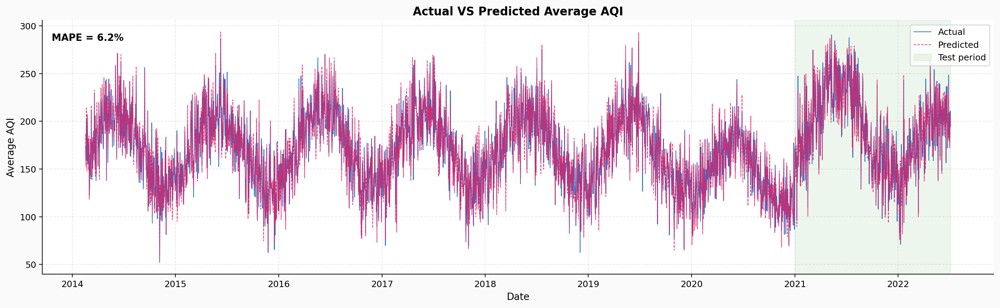
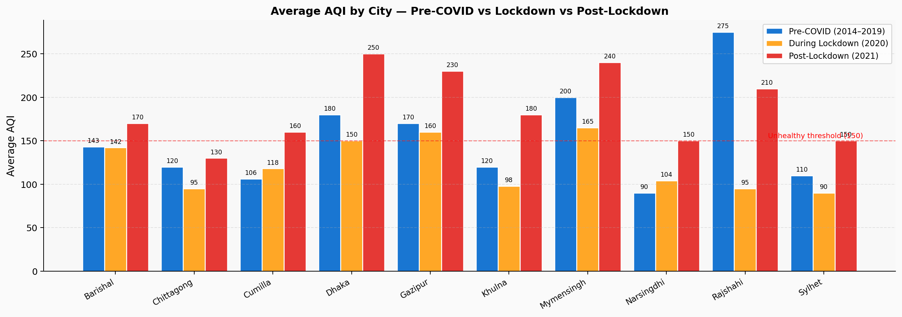
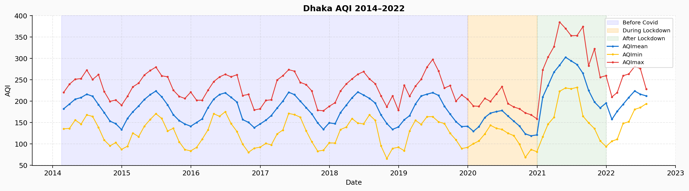

# Impact of COVID-19 Lockdowns on Air Quality in Bangladesh: Analysis and AQI Forecasting with SVR

[](https://colab.research.google.com/github/YOUR_GITHUB_USERNAME/aqi-covid19-bangladesh/blob/main/AQI_COVID19_Bangladesh.ipynb)
[](https://github.com/TSGreen/bangladesh-air-quality)
[](https://www.researchgate.net/publication/372261119_Impact_of_COVID-19_Lockdowns_on_Air_Quality_in_Bangladesh_Analysis_and_AQI_Forecasting_with_Support_Vector_Regression)
[](https://www.python.org/)

> **Published at:** IEEE INCET 2023 — 4th International Conference for Emerging Technology, Belgaum, India  
> **Authors:** Mohammed Tahmid Hossain, Afra Hossain, Sabrina Masum Meem, Md Fahad Monir, Md Saef Ullah Miah, Talha Bin Sarwar  
> **Institutions:** Independent University, Bangladesh · AIUB · Universiti Malaysia Pahang

---

## Overview

This repository contains the full reproducible code for our IEEE INCET 2023 paper analyzing Air Quality Index (AQI) trends across **10 major cities in Bangladesh** before, during, and after the COVID-19 lockdown, and forecasting AQI using **Support Vector Regression (SVR)**.

### Key Findings
- **AQI significantly decreased during COVID-19 lockdown (2020)** — highest AQI in 2020 was lower than 2019 or 2021
- **AQI is higher from December–March** (dry season, low rainfall)
- **Dhaka** had the highest AQI (170–190 pre-COVID, dropped to 150 during lockdown, rose to 250 post-lockdown)
- **SVR achieves MAPE ≈ 6.2%** — good and acceptable accuracy for AQI forecasting

---

## Results

### SVR Model Performance

| Metric | Value |
|:---:|:---:|
| **MAPE** | **~6.2%** |
| Kernel | RBF |
| gamma | 0.5 |
| C | 10 |
| epsilon | 0.05 |

> MAPE < 5% = perfectly accurate · 10–25% = low but acceptable. Our **6.2% is considered good**.



---

## City-Level Analysis





---

## AQI Categories (Table I — Bangladesh Standard)

| AQI Range | Level | Health Implication |
|:---:|:---:|:---|
| 0–50 | Good | Satisfactory, little or no risk |
| 51–100 | Moderate | Acceptable; some concern for sensitive groups |
| 101–150 | Caution | Sensitive groups may experience health effects |
| 151–200 | Unhealthy | Everyone may experience health hazards |
| 200–300 | Very Unhealthy | Entire population may experience serious effects |
| 301–500 | Extremely Unhealthy | Everyone likely to be affected |

---

## Dataset

**Clean Air and Sustainable Environment (CASE) Project**  
Ministry of Environment and Forest, Government of Bangladesh  
GitHub: https://github.com/TSGreen/bangladesh-air-quality

- **Period:** February 17, 2014 – July 6, 2022
- **~26,000 rows**
- **5 columns:** Date · Location · AQI · AQI Category · Range
- **10 cities:** Barishal · Chittagong · Cumilla · Dhaka · Gazipur · Khulna · Mymensingh · Narayanganj · Narsingdhi · Rajshahi · Sylhet

---

## Methodology

```
CASE Dataset  (Feb 17, 2014 – Jul 6, 2022 · ~26,000 rows)
        │
        ▼  Phase 1 — Pre-processing
Sort by date
Drop NaN: Date (13) · Location (49) · AQI (641) · AQI Category (63)
Replace ~5,000 DNA values → NaN → drop
Drop AQI Range column (insignificant)
Fix spelling errors
Sort date-wise for time series
        │
        ▼  Phase 1 — Comparative EDA
Split into 3 periods:
  Pre-COVID   : 2014-02-17 → 2019-12-31
  Lockdown    : 2020-01-01 → 2020-12-31
  Post-lockdown: 2021-01-01 → 2021-12-31
Compute max/min/mean/std per period
Resample monthly · yearly · by location
Location-wise plots (AQImean/AQImin/AQImax + period shading)
        │
        ▼  Phase 2 — SVR Forecasting
Train : 2014-02-28 → 2020-12-31
Test  : 2021-01-01 → 2022-06-01
MinMaxScaler(0,1) on AQImean
SVR(kernel=RBF, gamma=0.5, C=10, epsilon=0.05)
Inverse transform → MAPE evaluation (~6.2%)
```

---

## Repository Structure

```
aqi-covid19-bangladesh/
├── AQI_COVID19_Bangladesh.ipynb        ← main reproducible notebook
├── requirements.txt
├── README.md
├── .gitignore
├── fig_actual_vs_predicted_aqi.png
├── fig_city_aqi_comparison.png
└── fig_dhaka_aqi.png
```

---

## Setup & Usage

### 1. Clone
```bash
git clone https://github.com/YOUR_GITHUB_USERNAME/aqi-covid19-bangladesh.git
cd aqi-covid19-bangladesh
```

### 2. Install dependencies
```bash
pip install -r requirements.txt
```

### 3. Dataset
The dataset is **automatically downloaded** from GitHub in the notebook:
```
https://github.com/TSGreen/bangladesh-air-quality
```

### 4. Run
Open `AQI_COVID19_Bangladesh.ipynb` and run all cells.

---

## Citation

```bibtex
@inproceedings{hossain2023aqi,
  title     = {Impact of COVID-19 Lockdowns on Air Quality in Bangladesh:
               Analysis and AQI Forecasting with Support Vector Regression},
  author    = {Hossain, Mohammed Tahmid and Hossain, Afra and
               Meem, Sabrina Masum and Monir, Md Fahad and
               Miah, Md Saef Ullah and Sarwar, Talha Bin},
  booktitle = {2023 4th International Conference for Emerging Technology (INCET)},
  year      = {2023},
  month     = {May},
  address   = {Belgaum, India},
  publisher = {IEEE},
  doi       = {10.1109/INCET57972.2023.10170636}
}
```

---

## Acknowledgements
- [CASE Project](https://github.com/TSGreen/bangladesh-air-quality) — AQI dataset
- [Scikit-Learn](https://scikit-learn.org/) — SVR implementation
